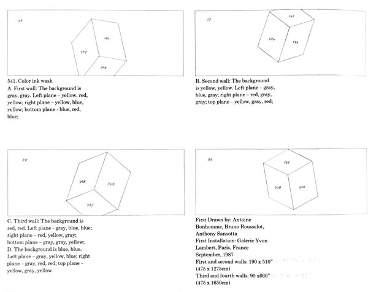

# 🎨 Final Project Pt 1: Create an Algorithm

### Teacher Notes && Overview

This part 1 project will lead directly into part 2 of the final - it's important that students are set up for success and create thoughtful artistic algorithms now to ensure a smooth process in part 2.

Please note that suggestions for the amount of prototype outputs are _just suggestions_ - you are welcome to adjust this to meet the needs or typical structures of your class.&#x20;

<figure><figcaption></figcaption></figure>

### Objectives

Students will be able to:

* Create artistic algorithms that other students are able to follow.
* Create prototypes of their algorithm output.

### Suggested Duration

1 - 3 Days, depending on the pace of student work

### Resources

* [Final Project Planning Guide](https://docs.google.com/document/d/1PzLbwPX8I00Z\_pOY1llU-8SNtoAPw7k0Pov6GdXAmVU/copy)

### Project Launch && Prompt

Begin by telling students that they are going to have a chance to show off everything they learned in this unit in a two-part final project: first, they will create an algorithm that can be followed to make art. Then, they will receive a few randomly selected algorithms from their classmates and will be tasked with making different art pieces from them.\
\
Before we get there, students must create their algorithm. They will actually create _three_ algorithms and then select their favorite that they would like to submit to the pool other students will be assigned from.

Distribute the final project planning packet to students. They will be writing an algorithm, deciding how it would best be executed, and then drawing several small examples. These examples do not need to be detailed or complete. You can reference Sol Le Witt instructions as an example, and are encouraged to reference past projects to get students thinking about what a good algorithm might be.

<figure><figcaption></figcaption></figure>

Students should be aware that their suggestion as to the format their algorithm should be completed in is _not_ a guarantee - their peers may follow their instruction and may not. After they've created their algorithms, they will randomly submit one that will be added into the classroom mix three times.

Keep three separate piles with one copy of each submitted algorithm in each pile. Shuffle well. Students will pick a paper from each pile; these will be the algorithms that they recreate and submit as their final body of work in the next project.

**Project Prompt:**

1. Reflect on what you have learned to do with code, and what materials you have access to in your classroom. _(The part 2 project will involve digital and analog creation!)_
2. Write 3 separate artistic algorithms that could be followed by someone else to create work.
3. For each algorithm, create 2-3 thumbnail/prototype/diagram sketches of _possible_ outcomes. The best algorithms should be specific enough that you know what to do, but open-ended enough that you could conceivably make something a little different each time.
4. Submit your planning packet to your teacher. Your selected algorithm should be clear and include any additional materials needed. (_EX: If you say 'Draw 5 eyes...' you may want a diagram of what you imagine an eye to look like._)&#x20;
